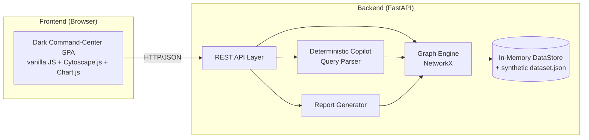
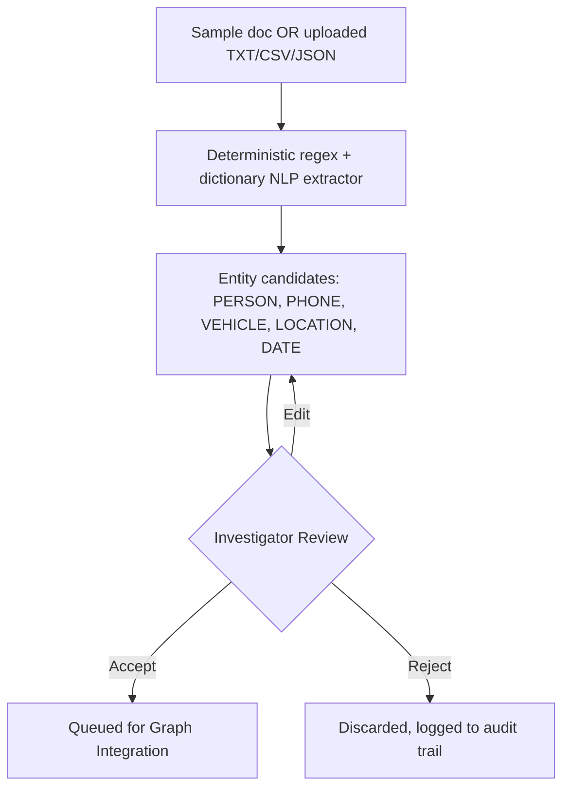
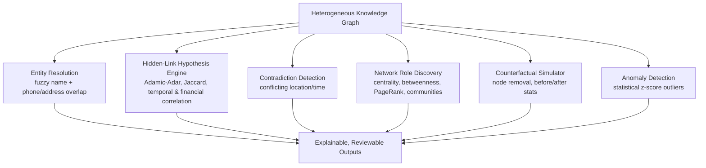
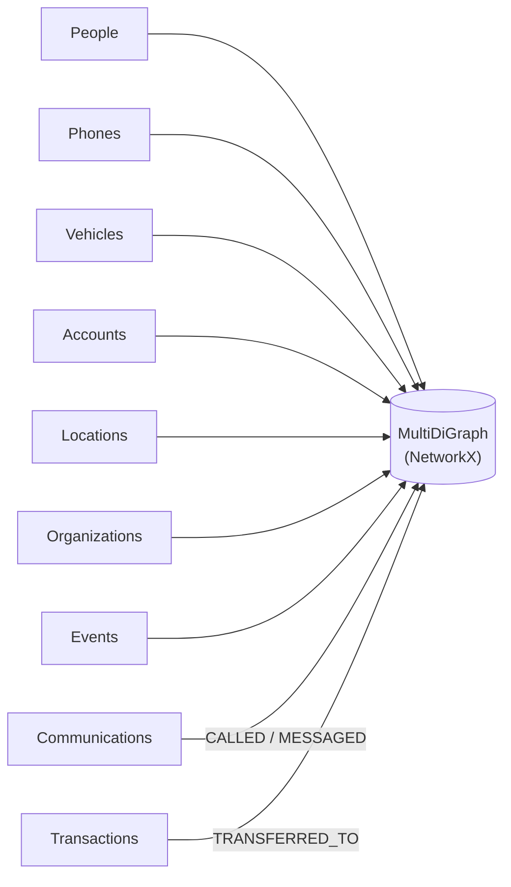
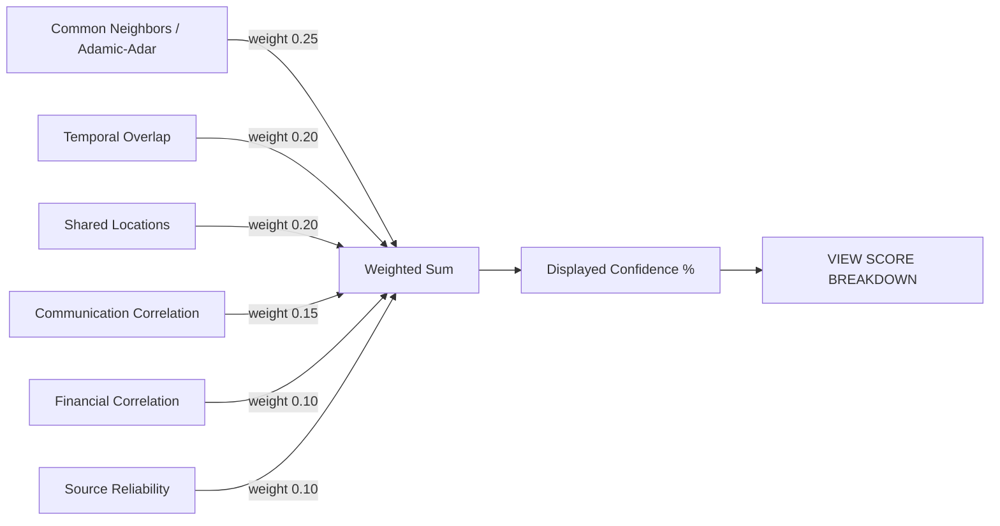
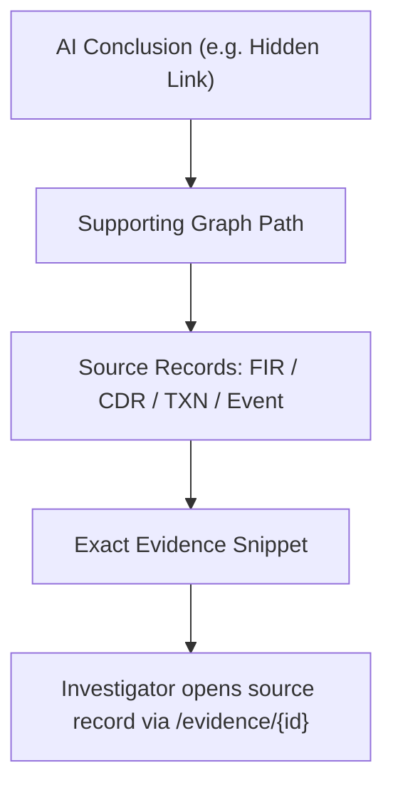

# NEXUS-X — Architecture

## 1. System Architecture

The `DataStore` class is the single seam between the API and the underlying
data representation. Every analytics function takes a `DataStore` and/or the
built `networkx.MultiDiGraph` as input — nothing queries a specific database
engine directly. Swapping NetworkX for Neo4j later means reimplementing the
functions in `graph_engine.py` against Cypher, without touching `main.py`'s
route contracts.

## 2. Data Ingestion Pipeline

## 3. AI / Analysis Pipeline

## 4. Knowledge Graph Pipeline

## 5. Hidden-Link Hypothesis Engine (Scoring)

## 6. Evidence Provenance Chain

## Why NetworkX now, Neo4j later

For a hackathon prototype, NetworkX gives zero-setup graph analytics
in-process, in Python, with no separate database server to install or
demo-fail on. The repository boundary (`DataStore` + the functions in
`graph_engine.py`) is deliberately the only place that touches the
in-memory representation, so a production rewrite would move to Neo4j by:

1. Replacing `DataStore.raw` JSON access with Cypher `MATCH` queries.
2. Replacing `person_graph_projection()` with a Cypher projection or GDS
   graph catalog projection.
3. Replacing NetworkX centrality/community calls with Neo4j Graph Data
   Science library equivalents (`gds.betweenness.stream`, `gds.louvain.stream`, etc).
4. Leaving `main.py`'s route signatures and response shapes untouched.
